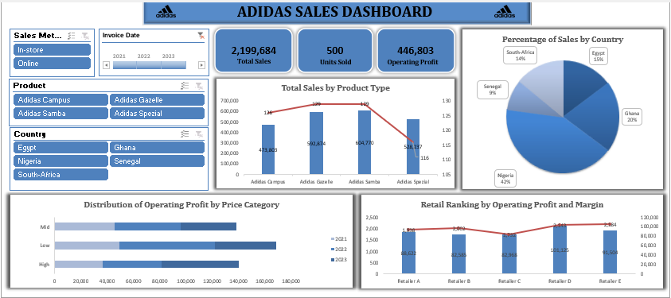
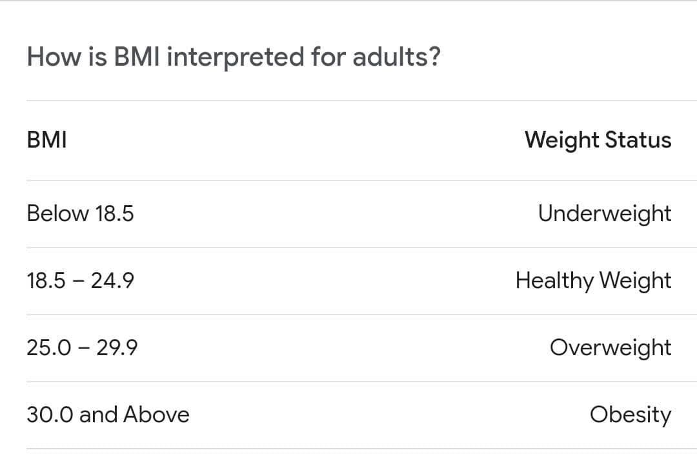
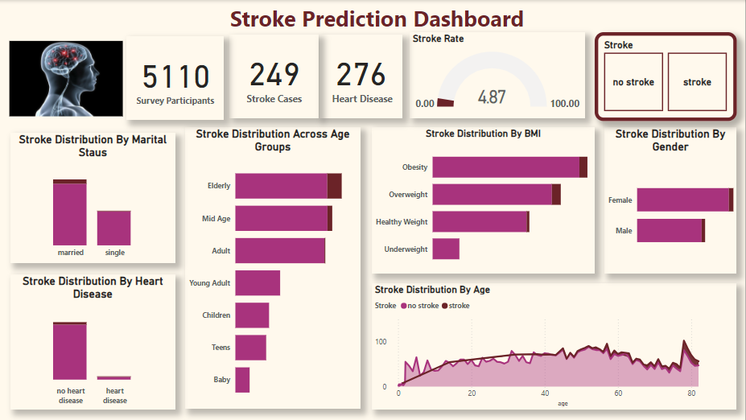

# Blaize Fatimot's Portfolio

# [Project 1: PetMind Implementation Strategies](https://medium.com/@bolanleblaize/data-analyst-associate-project-7040cdf55211)
This is a project I did in order to earn my Data Analyst Associate Certificate from DataCamp. I worked on a Pet Company dataset.
PetMind is a retailer of products for pets. They are based in the United States. PetMind sells products that are a mix of luxury items and everyday items.
### The objectives of the company are to:
- increase sales by selling more everyday products repeatedly. They have been testing this approach for the last year.
- get a report on how repeat purchases impact sales.
The analysis and visualization of this project were done with Excel and Python, and PowerBi.
The report of this project was done with Microsoft PowerPoint.

# [Project 2: Adidas Sneakers Sales Analysis](https://medium.com/@bolanleblaize/adidas-sneakers-sales-analysis-23d5dbd2055e)
The task of this project was to analyze Adidas Sneakers Sales Data to uncover trends and insights that drive success in the industry. 
I used my Excel Skills to perform data analysis to provide actionable recommendations.

### The objectives of this analysis are to:
- Identify Top-Performing Categories and Platforms
- Highlight Successful Regions
- Make Data-Driven Recommendations
  
### Data Insights and Recommendations
#### Top Performing Category
- The Total sales are estimated at $2,199,684 from 500 units sold and the total operating profit is $446,803.
- Adidas Samba is a top-performing product with a total sales of $604,770 (28% of total sales) and 129 units sold (26% of total sales).
- Adidas Gazelle is a strong contender in the market with a total sales of $592,874 (27% of total sales) and 129 units sold(26% of total).
- Adidas Gazelle has the highest profit margin among all products, highlighting strong profitability and demand. It is competitive with Adidas Samba.
- Adidas Spezial has sales of $528,237 (24% of total sales) and 116 units sold (23% of total sales) which is slightly lower than Samba and Gazelle but still strong.
- Adidas Campus has a total sales of $473,803 with 126 units sold which is the lowest among the four products, indicating a need for reassessment.
#### *Recommendations:*
- Adidas should focus on Adidas Samba and Gazelle.
- There should be an allocation of more marketing budget to Adidas Samba and Gazelle as they drive the highest sales and profitability.
- There should be more expansion of production or an offering of limited-edition variants to maintain consumer interest.
- There should be a reassessment of the Adidas Campus. It is important to investigate why it generates significantly lower revenue despite selling nearly as many units as Samba and Gazelle by getting consumer feedback.
- There should be an adjustment of pricing strategy for Adidas Campus, improvement of product design, or targeting a new audience.
- There should be a priority of stock levels in regions where Adidas Spezial performs strongly to maximize its steady demand.
  
#### Sales Platform
- The Total sales for the Online platform is $1,168,616 (53% of total sales) with 262 units sold.
- The Operating Profit for the Online platform is a total sum of $234,234 with a higher profit margin than the online sales platform.
- The Total sales for the In-person platform are $1,031,068 which is 47% of total sales) with 238 units sold. The Operating Profit is a total sum of $212,569.
#### *Recommendations:*
- Adidas should optimize In-Person Sales by investing in regions and markets where in-person sales dominate (e.g., Senegal).
- Adidas should enhance Online Sales by launching targeted online promotions and investing in website optimization and digital advertising campaigns.
  
#### Sales by Country
- Nigeria is a top market as it accounts for 42% of total sales over three years. Nigeria generates $491,477 in online sales and $432,350 in in-person sales.
- Nigeria is the most critical market, driving both online and in-person sales.
- Senegal is a low-performing market as it accounts for only 9% of total sales. Senegal generates $67,756 in online sales and $126,821 in in-person sales.
- In-person sales dominate in Senegal, showing a preference for physical shopping.
#### *Recommendations:*
- Adidas should Invest more in Nigeria by running ads to strengthen its online presence in platforms in Nigeria, as they contribute significantly to sales.
- They should launch targeted digital campaigns to further grow online sales.
- Also, Adidas should focus on boosting Senegal’s Sales by focusing on in-person marketing campaigns to align with consumer preferences.
- They should also partner with local retailers to enhance brand visibility and accessibility.
- Adidas should use Nigeria as a benchmark for expanding into high-potential markets with similar consumer behaviour.

#### Price Category Performance
- The Low Price Category generated higher overall profits over the last three years with a profit of $46,741 in 2023, a profit of $72,560 in 2022, and a profit of $49,617 in 2021.
- The High Price Category Outperformed the low category in 2023 with a sum of $58,319 in operating profit.
#### *Recommendations:*
- Adidas should capitalize on the strong performance of the high-price category in 2023 by introducing new premium products or limited-edition sneakers to sustain momentum.
- They should sustain low-price category demand by providing more low-price sneakers in regions with price-sensitive consumers (e.g. Senegal).

#### Retailer Performance
- Retailer D is a top retailer that leads with an operating profit of $101,125 and an operating margin of 2,143.
- Retailer E is a high-margin performer with the highest operating margin at 2,184 and an operating profit of $91,504.
- Retailers A, B, and C perform similarly, with operating profits ranging between $82,585 and $88,622.
#### *Recommendations:*
Adidas should prioritize Retailer D by strengthening partnerships with Retailer D as they contribute the most to profitability.
Adidas should explore opportunities to expand its product offerings or increase inventory allocation of Retailer D.
There should be a collaboration with Retailer E to understand how they maintain higher margins and replicate their strategies across other retail partners.

### Summary of Key Insights
1. Adidas Samba is the top-performing product, contributing 28% of total sales. Focus marketing and inventory efforts on Samba and Gazelle.
2. Nigeria drives 42% of total sales, with strong contributions from both online and in-person platforms.
3. In-person sales are more profitable than online, but online platforms present significant growth opportunities in key markets.
4. Overall, low-price sneakers dominate, but the high-price category showed stronger performance in 2023, signalling a shift in consumer preferences.
5. Retailers D and E lead in operating profit and margins, making them key partners for future growth.

The implementation of these strategies will help Adidas maximize Sneaker sales, improve profitability, and ensure sustainable growth in the competitive footwear market.

# Project 3: Stroke Prediction Analysis
A Stroke Center aims to identify individuals at higher risk of having a stroke in order to enhance awareness campaigns. 
For this analysis, I utilized a dataset in CSV format, which I imported into Power BI. After transforming the data, I performed data manipulation to ensure it was thoroughly cleaned.
I created two conditional columns for further insights. The first column was used to create an age group such as If age is less than or equal to 2 then “Child”, etc.

The Second conditional column was used to create BMI interpretation, if BMI is less than 18.5 then “Underweight”.

The analysis and visualization of this project were done with PowerBi.
The report of this project was done with Microsoft PowerPoint.

### Key Insights:
- The total number of survey participants, amounted to 5,110, and 249 participants actually have stroke.
- The analysis indicates that Elderly individuals, who are above the age of 60 are more likely to experience a stroke.
- Additionally, those classified as Obese or Overweight are at a greater risk of developing stroke compared to those with a healthy weight.
This data-driven approach can help inform targeted awareness initiatives for stroke prevention.

# [Project 4: Profit and Loss Analysis](https://medium.com/@bolanleblaize/profit-and-loss-analysis-43eb6c81b270)
The goal of this project is to analyze P&L data to understand revenue, expenses, and overall profitability across all branches. This analysis will provide a clear picture of each branch's financial health and actionable insights to improve performance.
### Project Tasks
- Identify and address any data entries to ensure all financial figures are formatted correctly in Naira.
- Categorize transactions into revenues and expenses based on the Account Category. Calculate total revenue, total expenses, and net profit for each branch over the years.
- Determine the percentage changes in revenue and expenses year-over-year. Calculate the profit margin for each branch.
- The visualization of analysis by using charts and graphs to illustrate trends in revenue, expenses, and net profit for each branch over the four-year period.
- Give Data-Driven insights and Make Recommendations
  
 
The analysis and visualization of this project were done with PowerBi.
The report of this project was done with Microsoft PowerPoint.
# Project 5: All Fuels Futures Data Analysis
SQL, Python, PowerBI
